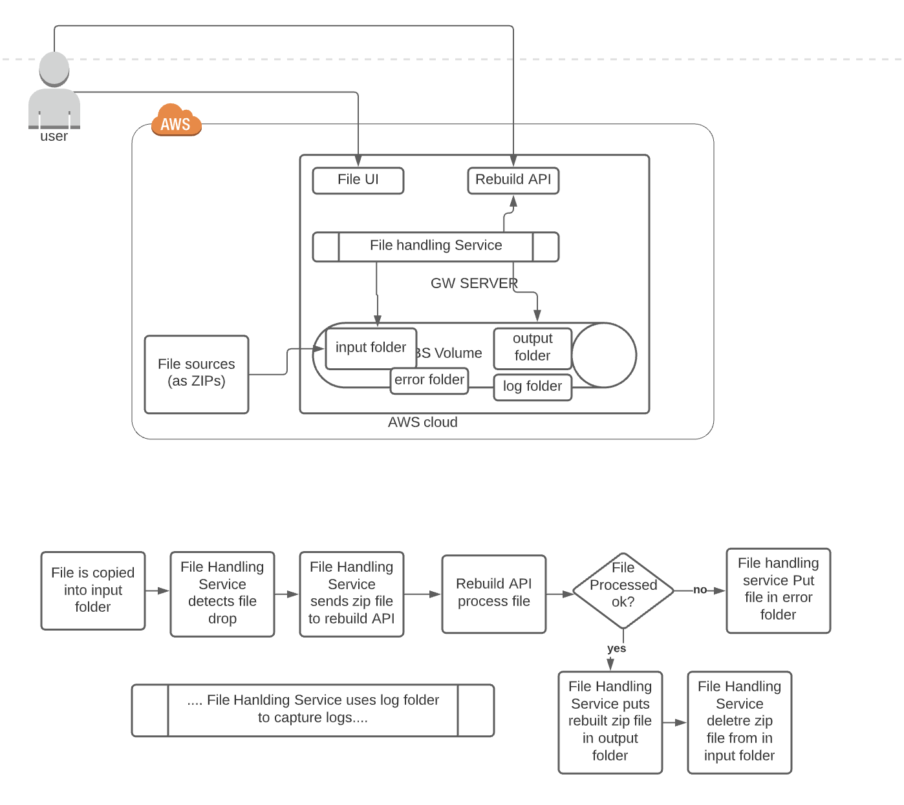

#  K8 rebuild folder to folder

## Process Overview

### Creating custom AMI
- - - -

* To create a custom AMI, OVA file stored in S3 bucket need to be imported. Run below command to import ova file from s3 bucket and create custom AMI
```shell 
./packer/import-ova.sh <S3_PATH_OF_OVA>
 ```
* Once OVA import is completed, create an ec2 instance using custom AMI that is created. While creating ec2 instance, allow inbound connections to 22,80,443 ports
*  Once instance is created, Login to created instance by using below command
```shell
  $ssh glasswall@<instanceip>
```

* Once login is successfull, change default password using below command and enter new choosen password
```shell
    $passwd glasswall
  ```

* Once instance is created, to submit input files and store processed files, there are two available options as explained below
  
### Option 1: Mounting EBS Volume
- - - -
* Once instance is created, a new EBS volume is to be attached by running below command
```shell 
./packer/attch-volume.sh <INSTANCE_ID> <optional EBS volume size. Default: 50>
 ```
* Once EBS volume is created, mount the EBS volume by running below command. Pass the path in which EBS volume is to be mounted as an argument to ` mount-volume.sh` command
```shell
 ./packer/mount-volume.sh </mount/path>
  ```
* Once mounting of EBS volume is completed, this mount point can be used in docker-compose to pass as an arguement

### Option 2: Mounting EFS Volume
* Once instance is created, a new EFS volume can be created and attached by running below command
```shell 
./packer/attch-efs-volume.sh <INSTANCE_ID>
```
```shell
 ./packer/mount-efs-volume.sh </mount/path>
```
* Once mounting of EFS volume is completed, this mount point can be used in docker-compose to pass as an arguement

  
### Running Service
- - - -
* In mount path, there are four folders: Input, Output, Error and logs which are used for file handling service

* Zip the files that needs to be processed and copy the zip file `<mount path>/input`
```script
zip files .
cp <zip name> <mountpath>/input
```


* Once zip file is copied, File handling service will automatically pick up the folder and will process it. 

* Once processing is completed, you can find the processed file in `<mount path>/output`. 

* Incase of any errors during processing, file will be moved to `<mount path>/error`. Logs of processing can be found in `<mount path>/logs`


